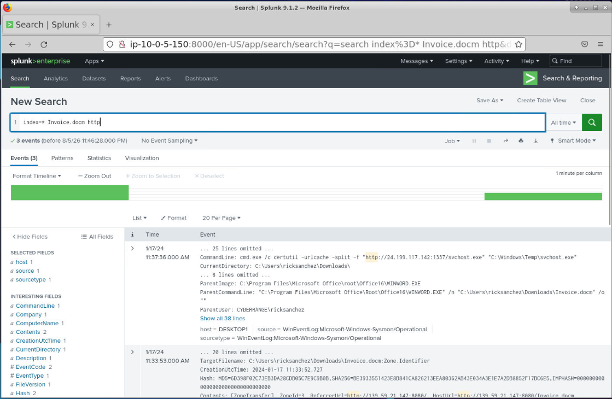
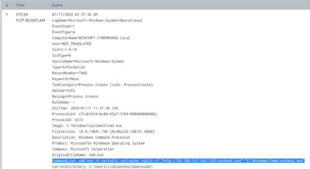
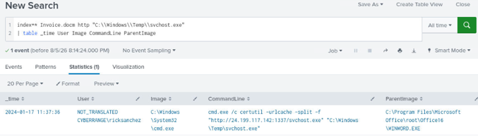
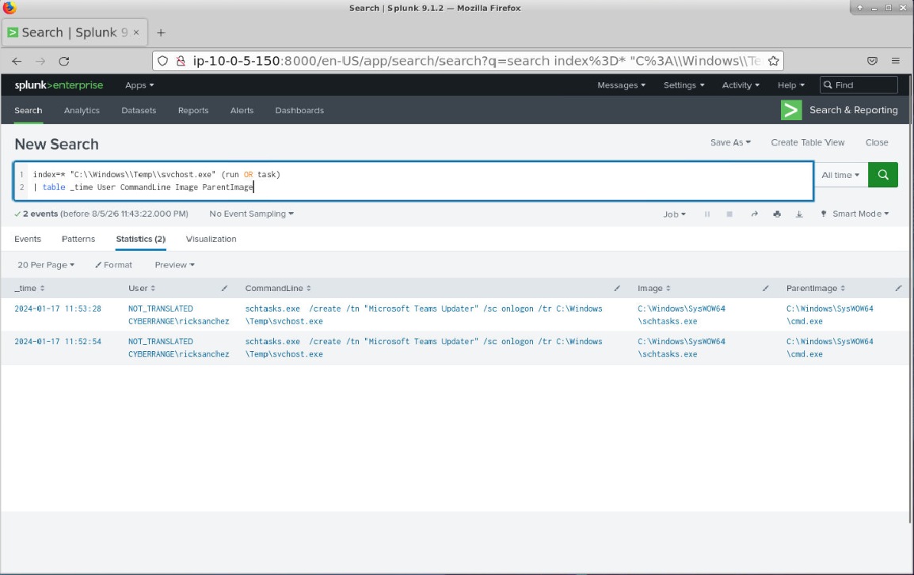
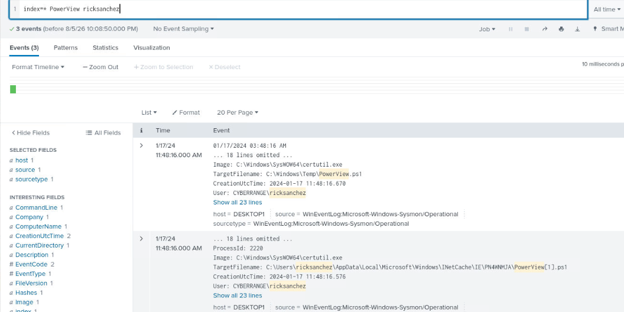
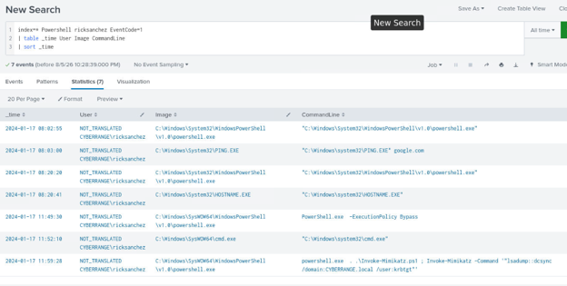

# Splunk IT — Phishing to Active Directory Compromise
### Blue Team Labs Online — SOC Investigation Write-Up

**Platform:** Blue Team Labs Online
**Lab:** Splunk IT
**Tools:** Splunk (SPL)
**Scenario:** An employee clicked a malicious link, leading to the endpoint being compromised. After executing malicious files and establishing a foothold, the attacker went on to compromise Active Directory by dumping credentials.

---

## 1. Summary

This investigation traces a full attack chain inside Splunk — from an initial phishing email to a domain-wide credential dump. Using SPL against endpoint (process-creation) and web logs, I pivoted from the phishing delivery to the dropped payload, the compromised domain account, the attacker's persistence mechanism, their Active Directory reconnaissance, and finally the technique used to dump domain credentials.

The approach throughout was the same: start with a broad, unfiltered search to understand what data was available, then use each confirmed artifact — a filename, an IP, a username — to narrow the next search. Some early searches (like filtering directly on IP) returned nothing, so I had to try different pivot points before finding one that worked. That trial and error is part of the write-up below, since it reflects how the investigation actually went.

## 2. Attack Timeline

1. **Initial delivery** — A phishing email titled "Invoice" reached an employee. Clicking the embedded link triggered a download of a malicious Word document, `Invoice.docm`, from `139.59.21.147:8080` (~11:33:53 AM, based on web log timestamps).
2. **Execution** — The employee opened `Invoice.docm`. This spawned `WINWORD.EXE`, which in turn launched `cmd.exe` as a child process.
3. **Payload delivery** — `cmd.exe` downloaded a second-stage file disguised as `svchost.exe` from `24.199.117.142:1337` and saved it to `C:\Windows\Temp\svchost.exe`. All of this traced back to the domain account **CYBERRANGE\ricksanchez**.
4. **Persistence** — The attacker used `schtasks.exe` to create a scheduled task named **"Microsoft Teams Updater"**, a name chosen to blend in with legitimate software.
5. **Internal reconnaissance** — The attacker ran **PowerView.ps1** under the compromised account to enumerate Active Directory.
6. **Credential access** — The attacker ran **Invoke-Mimikatz.ps1**, executing an `lsadump::dcsync` command against the `krbtgt` account — a **DCSync** attack that pulls password data from the domain by mimicking a domain controller's replication request.

## 3. Investigation Steps

All analysis was done in Splunk's Search & Reporting app, with the time range set to **All Time** so no relevant events would be missed. I started broad and narrowed step by step, using each confirmed artifact to pivot into the next question.

### 3.1 Getting familiar with the data
```spl
index=*
```
Before searching for anything specific, I ran this to see what data existed in the environment.

### 3.2 Finding the phishing delivery IP
The scenario pointed to a phishing email named "Invoice," so I started there:
```spl
index=* Invoice
```
This dropped the result count from roughly 28,920 events to 13 — narrow enough to review manually. A few direct IP filters didn't return anything useful, so I pivoted to filtering on web activity instead:
```spl
index=* Invoice http
```
That brought it down to 3 events. Comparing timestamps, two of them lined up at 11:33:53 AM, and one contained:
```
HostUrl=http://139.59.21.147:8080/Invoice.docm
```


*Web log event showing Invoice.docm being downloaded from 139.59.21.147:8080.*

**Finding:** the malicious document was downloaded from `139.59.21.147:8080`.

### 3.3 Tracing what happened after the document was opened
With the malicious file identified, I looked for process activity tied to it and found a process-creation event where `WINWORD.EXE` was the parent process and `cmd.exe` was the child. The command line showed `cmd.exe` saving a file to:
```
C:\Windows\Temp\svchost.exe
```
The same event also contained the download source:
```
http://24.199.117.142:1337/svchost.exe
```


*CommandLine showing certutil.exe used to download and save the payload as C:\Windows\Temp\svchost.exe.*

**Finding:** a second-stage payload, disguised as `svchost.exe`, was pulled from an external server and dropped into a non-standard location — the legitimate `svchost.exe` runs from `System32`, not `Temp`.

### 3.4 Identifying the compromised account
Using Splunk's **Add to Search** feature, I combined the known artifacts into one query:
```spl
index=* Invoice.docm http "C:\Windows\Temp\svchost.exe"
| table _time User Image CommandLine ParentImage
```


*Table view confirming CYBERRANGE\ricksanchez as the compromised domain account.*

**Finding:** the activity was tied to the domain account **CYBERRANGE\ricksanchez**.

### 3.5 Checking for persistence
I dropped the earlier filters and focused only on the dropped payload:
```spl
index=* "C:\Windows\Temp\svchost.exe" persist
```
This returned no results, so I broadened the keywords:
```spl
index=* "C:\Windows\Temp\svchost.exe" (run OR task)
| table _time User Image CommandLine ParentImage
```
This returned 2 events. The `CommandLine` field showed `schtasks.exe` being run with:
```
/create /tn "Microsoft Teams Updater"
```


*CommandLine showing schtasks.exe creating the "Microsoft Teams Updater" scheduled task.*

**Finding:** persistence was established through a scheduled task named to look like legitimate Microsoft Teams software — the same table also answered what the task was called.

### 3.6 Looking for internal reconnaissance
Next, I looked at PowerShell activity, since that's where recon tooling would show up:
```spl
index=* EventCode=1 powershell
```
`EventCode=1` is a process-creation event, so this shows every program that ran and who started it — but 1093 events was too broad to work through manually. Adding the known compromised username narrowed it down:
```spl
index=* EventCode=1 powershell ricksanchez
| table _time User Image CommandLine ParentImage
```
This returned 7 events. Most were ordinary PowerShell usage (`ping`, `hostname`, opening a PowerShell session), but one entry stood out immediately — a call to `Invoke-Mimikatz.ps1` running `lsadump::dcsync`. That was clearly credential dumping, but since I was still working through the chain in order, I noted it and kept looking for the reconnaissance step. Based on the fact that PowerView is a well-known AD enumeration tool, I searched for it directly:
```spl
index=* PowerView ricksanchez
```
This returned 3 events, one of which explicitly logged **PowerView.ps1** being used for AD enumeration.


*Event showing PowerView.ps1 executed for AD enumeration.*

**Finding:** the attacker used `PowerView.ps1` to enumerate the domain.

### 3.7 Confirming the credential dumping tool
Circling back to the Mimikatz activity spotted earlier, I rebuilt the query to organize it cleanly:
```spl
index=* EventCode=1 powershell ricksanchez
| table _time User Image CommandLine
| sort _time
```


*CommandLine showing Invoke-Mimikatz.ps1 executing lsadump::dcsync against the krbtgt account.*

**Finding:** `Invoke-Mimikatz.ps1` was executed and confirmed as the credential dumping tool.

### 3.8 Identifying the credential dumping technique
Looking closely at the command line for the Mimikatz execution, it included `lsadump::dcsync` targeting the `krbtgt` account. After researching what this meant, I confirmed it as **DCSync** — a technique that abuses legitimate Active Directory replication permissions to pull password data as if the requesting host were a domain controller.

## 4. Key Findings

| Category | Detail |
|---|---|
| Initial access | Phishing email ("Invoice") led to a malicious download |
| Malicious document | `Invoice.docm`, downloaded from `139.59.21.147:8080` |
| Dropped payload | `C:\Windows\Temp\svchost.exe` |
| Payload source | `http://24.199.117.142:1337/svchost.exe` |
| Compromised account | `CYBERRANGE\ricksanchez` |
| Persistence | Scheduled task `"Microsoft Teams Updater"` via `schtasks.exe` |
| Reconnaissance tool | `PowerView.ps1` |
| Credential dumping tool | `Invoke-Mimikatz.ps1` |
| Credential dumping technique | DCSync (`lsadump::dcsync`, targeting `krbtgt`) |

## 5. MITRE ATT&CK Mapping

| Tactic | Technique | ID | Evidence |
|---|---|---|---|
| Initial Access | Phishing: Spearphishing Link | T1566.002 | Employee clicked a link in a phishing email ("Invoice"), leading to the malicious document download |
| Execution | User Execution: Malicious File | T1204.002 | `Invoice.docm` opened by the user, spawning `WINWORD.EXE` |
| Persistence | Scheduled Task/Job: Scheduled Task | T1053.005 | `schtasks.exe` created a task named `"Microsoft Teams Updater"` |
| Credential Access | OS Credential Dumping: DCSync | T1003.006 | `Invoke-Mimikatz.ps1` ran `lsadump::dcsync` against the `krbtgt` account |
| Discovery | Account Discovery: Domain Account | T1087.002 | `PowerView.ps1` executed for Active Directory enumeration |

## 6. Conclusion

This lab walked the full chain from a phishing email to a domain-wide credential compromise, and rebuilding it in Splunk was a good exercise in disciplined pivoting: start wide, use every confirmed artifact to narrow the next search, and don't assume — check. A couple of things stood out while doing this.

First, how much a single known IOC cuts through noise once you have it — once `ricksanchez` was identified, it became the pivot point for almost every search that followed. Second, how much attackers lean on names that blend in: `svchost.exe` sitting in `Temp` instead of `System32`, a scheduled task called "Microsoft Teams Updater" — neither looks suspicious at a glance, only when you check the path, the parent process, or the full command line. Finally, DCSync was the most interesting technique in this investigation, since it doesn't require ever touching the domain controller directly — just enough replication rights on a compromised account, which is exactly why account privilege monitoring matters as much as endpoint detection.

This was a simulated environment (Blue Team Labs Online), but the process — start broad, pivot on confirmed indicators, and map the result to a framework like MITRE ATT&CK — mirrors real SOC triage work.
