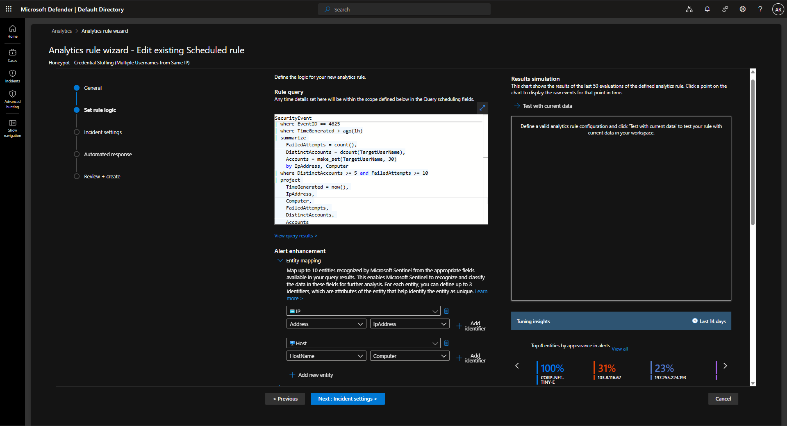
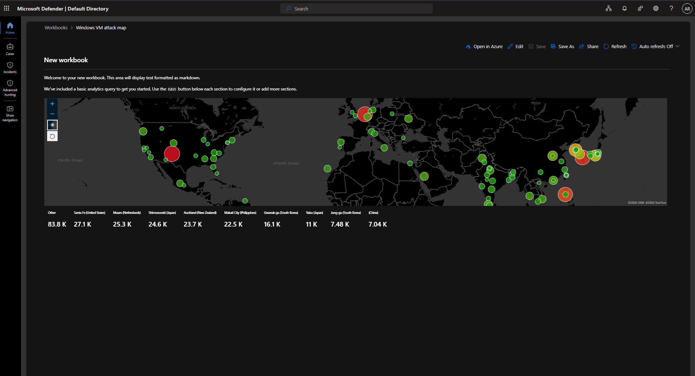

# Azure Sentinel Honeypot Lab — Brute-Force Detection & Investigation

Custom detection engineering and incident investigation on a real, internet-exposed honeypot, monitored with Microsoft Sentinel.

| | |
|---|---|
| **Author** | Angel Rodriguez Bolivar |
| **Date** | July 2026 |
| **Base lab** | Josh Madakor Cyber Home Lab (Microsoft Sentinel 2025) |
| **Honeypot VM** | `CORP-NET-TINY-E1` |

---

## Overview

A Windows VM (`CORP-NET-TINY-E1`) was deployed in Azure and deliberately exposed to the internet to attract real attack traffic. Failed logon events (Event ID `4625`) flow into a Log Analytics Workspace, where Microsoft Sentinel evaluates three custom analytics rules.

The honeypot received **real brute-force traffic from multiple countries**. The resulting incidents were triaged and documented end-to-end — see [Investigation](#investigation).

> **Key finding:** a single IP address generated **728 failed logon attempts across 8 distinct accounts**.

## Lab Architecture

```
Internet attackers ──► CORP-NET-TINY-E1 (Azure VM, intentionally exposed)
                              │  Windows Security Events (EventID 4625)
                              ▼
                     Log Analytics Workspace
                              │
                              ▼
                      Microsoft Sentinel
             (3 custom analytics rules → incidents)
```

## Detection Rules

Three complementary rules, each targeting a distinct brute-force pattern. All rules are **Medium severity** and **Enabled**.

| # | Rule name | MITRE ATT&CK | Pattern detected |
|---|-----------|--------------|------------------|
| 1 | Honeypot - High Volume Failed Logons from Single IP | [T1110.001](https://attack.mitre.org/techniques/T1110/001/) | Sustained brute force from one source |
| 2 | Honeypot - Credential Stuffing (Multiple Usernames from Same IP) | [T1110.004](https://attack.mitre.org/techniques/T1110/004/) | One IP cycling through many accounts |
| 3 | Honeypot - High Volume Failed Logons Burst | [T1110](https://attack.mitre.org/techniques/T1110/) | Short, high-volume bursts against a host (source-agnostic) |

### Rule 1: Honeypot - High Volume Failed Logons from Single IP

- **MITRE ATT&CK:** T1110.001 — Brute Force: Password Guessing
- **Severity:** Medium · **Status:** Enabled
- **Logic:** ≥ 15 failed logons from a single IP against one host within 1 hour. Captures distinct accounts targeted plus first/last attempt timestamps for timeline context.

```kql
SecurityEvent
| where EventID == 4625
| where TimeGenerated > ago(1h)
| summarize
    FailedAttempts = count(),
    DistinctAccounts = dcount(TargetUserName),
    FirstAttempt = min(TimeGenerated),
    LastAttempt = max(TimeGenerated),
    Accounts = make_set(TargetUserName, 20)
    by IpAddress, Computer
| where FailedAttempts >= 15
| project
    TimeGenerated = LastAttempt,
    IpAddress,
    Computer,
    FailedAttempts,
    DistinctAccounts,
    Accounts,
    FirstAttempt,
    LastAttempt
```

**Entity mapping:** IP → `IpAddress` | Host → `Computer`

### Rule 2: Honeypot - Credential Stuffing (Multiple Usernames from Same IP)

- **MITRE ATT&CK:** T1110.004 — Brute Force: Credential Stuffing
- **Severity:** Medium · **Status:** Enabled
- **Logic:** ≥ 5 distinct usernames **and** ≥ 10 total failures from a single IP within 1 hour. Catches account-enumeration behavior that single-account thresholds miss.

```kql
SecurityEvent
| where EventID == 4625
| where TimeGenerated > ago(1h)
| summarize
    FailedAttempts = count(),
    DistinctAccounts = dcount(TargetUserName),
    Accounts = make_set(TargetUserName, 30)
    by IpAddress, Computer
| where DistinctAccounts >= 5 and FailedAttempts >= 10
| project
    TimeGenerated = now(),
    IpAddress,
    Computer,
    FailedAttempts,
    DistinctAccounts,
    Accounts
```

**Entity mapping:** IP → `IpAddress` | Host → `Computer`

### Rule 3: Honeypot - High Volume Failed Logons Burst

- **MITRE ATT&CK:** T1110 — Brute Force
- **Severity:** Medium · **Status:** Enabled
- **Logic:** ≥ 50 failed logons against a host within any 5-minute window over the last 30 minutes. Host-centric and source-agnostic, so it still fires when attackers rotate or distribute source IPs.

```kql
SecurityEvent
| where EventID == 4625
| where TimeGenerated > ago(30m)
| summarize
    FailedAttempts = count()
    by bin(TimeGenerated, 5m), Computer
| where FailedAttempts >= 50
| project
    TimeGenerated,
    Computer,
    FailedAttempts
```

**Entity mapping:** Host → `Computer`

## Investigation

Attack traffic originated from multiple countries. The most significant activity — **one IP with 728 failed attempts across 8 accounts** — was investigated end-to-end: source scoping, targeted accounts, and attack timeline.

Full write-up: **[investigation-honeypot-bruteforce.md](./investigation-honeypot-bruteforce.md)**

## Skills Demonstrated

- **Microsoft Sentinel** — custom analytics rules, entity mapping, incident triage
- **KQL** — `summarize`, `dcount`, `make_set`, `bin()`, time-windowed aggregation
- **Detection engineering** — complementary rule design, threshold tuning, MITRE ATT&CK mapping
- **Windows event log analysis** — failed logon telemetry (Event ID 4625)
- **Azure** — VM deployment, network exposure, Log Analytics integration
- **Investigation & documentation** — incident scoping and written analysis

## Design Notes — Quality over Quantity

This lab intentionally ships **three tuned rules** rather than a large ruleset:

- Each rule covers a **distinct attack pattern** — sustained single-IP brute force, multi-account attempts from one IP, and source-agnostic bursts — with minimal overlap.
- Thresholds are set to fire on **real attack volume**, not isolated failed logons, keeping incident fidelity high.
- Every rule includes **entity mapping**, so incidents auto-populate IP and host entities and are immediately pivotable during investigation.
- One **deep, documented investigation** demonstrates more analyst capability than a wall of shallow alerts.


## Screenshots

### Analytics Rules Overview


### Rule 1 – High Volume Failed Logons from Single IP


### Rule 2 – Credential Stuffing


### Rule 3 – High Volume Failed Logons Burst


### Attack Map (GeoIP)



## Credits

Base environment from **Josh Madakor's Cyber Home Lab (Microsoft Sentinel 2025)**. All detection rules, tuning decisions, and the investigation write-up are original extensions of that lab.
