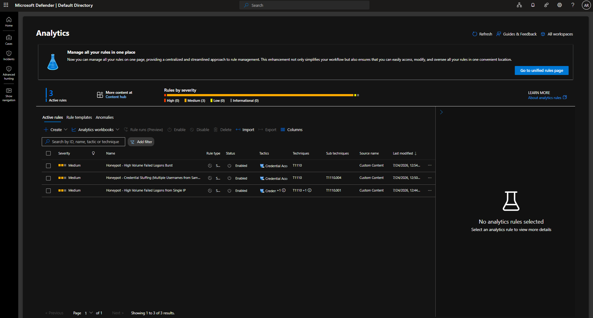

# Azure Sentinel Honeypot Lab — Brute-Force Detection & Investigation

Incident detection and end-to-end investigation on a real, internet-exposed honeypot monitored with Microsoft Sentinel.

| | |
|---|---|
| **Author** | Angel Rodriguez Bolivar |
| **Date** | July 2026 |
| **Base lab** | Josh Madakor — Cyber Home Lab (Microsoft Sentinel 2025) |
| **Honeypot VM** | `CORP-NET-TINY-E1` |

---

## Overview

A Windows VM (`CORP-NET-TINY-E1`) was deployed in Azure and deliberately exposed to the internet to attract live attack traffic. Failed logon events (Event ID `4625`) are forwarded to a Log Analytics Workspace, where Microsoft Sentinel evaluates three brute-force analytics rules and raises incidents.

The honeypot attracted real brute-force traffic from multiple countries within hours of exposure. The highest-volume incident was triaged end to end and closed as a **True Positive**.

> **Key finding:** a single source IP generated **728 failed logon attempts across 8 distinct accounts in roughly one hour.**

## Lab Architecture

```
Internet attackers ──► CORP-NET-TINY-E1 (Azure VM, intentionally exposed)
                              │  Windows Security Events (EventID 4625)
                              ▼
                     Log Analytics Workspace
                              │
                              ▼
                      Microsoft Sentinel
              (3 analytics rules → incidents)
```

## Detection Rules

Three complementary rules, each covering a distinct brute-force pattern with minimal overlap. All are Medium severity, enabled, and include entity mapping so incidents auto-populate IP and host entities and are immediately pivotable.

| # | Rule | MITRE ATT&CK | Threshold |
|---|------|--------------|-----------|
| 1 | High Volume Failed Logons from Single IP | [T1110.001](https://attack.mitre.org/techniques/T1110/001/) | ≥ 15 failures from one IP against one host in 1 hour |
| 2 | Credential Stuffing (Multiple Usernames from Same IP) | [T1110.004](https://attack.mitre.org/techniques/T1110/004/) | ≥ 5 distinct accounts **and** ≥ 10 failures from one IP in 1 hour |
| 3 | High Volume Failed Logons Burst | [T1110](https://attack.mitre.org/techniques/T1110/) | ≥ 50 failures against a host in any 5-minute window |

Rule 3 is host-centric and source-agnostic, so it still fires when an attacker rotates or distributes source IPs — coverage that rules 1 and 2 lose by keying on `IpAddress`.

Thresholds were tuned against observed attack volume rather than isolated failed logons, keeping incident fidelity high.

**Full queries, comments, and operational notes:** [`../../detections/kql-brute-force-rules.md`](../../detections/kql-brute-force-rules.md)



## Investigation

Failed logon traffic originated from multiple countries. The most significant activity — source IP `197.255.224.193`, **728 failed attempts across 8 accounts in ~1 hour** — was investigated end to end: source scoping and GeoIP attribution, enumeration of targeted accounts, and attack timeline reconstruction.

**Disposition: True Positive.** Confirmed automated brute-force activity from external infrastructure. No successful authentication (Event ID `4624`) was observed from the source.

**Full write-up:** [`investigation-honeypot-bruteforce.md`](./investigation-honeypot-bruteforce.md)


## Skills Demonstrated

- **Microsoft Sentinel** — analytics rule configuration, entity mapping, incident triage
- **KQL (foundational)** — reading, adapting, and testing queries: `summarize`, `dcount`, `make_set`, `bin()`, time-windowed aggregation
- **MITRE ATT&CK** — mapping observed activity to techniques (T1110, T1110.001, T1110.004)
- **Windows event log analysis** — failed logon telemetry (Event ID 4625)
- **Azure** — VM deployment, network exposure, Log Analytics integration
- **Investigation & documentation** — incident scoping, timeline reconstruction, written analysis

## Credits & Transparency

Base environment adapted from **Josh Madakor's Cyber Home Lab (Microsoft Sentinel 2025)**.

The KQL detection queries were initially drafted with AI assistance, then adapted, tested, and deployed by me against this environment. The lab build, incident triage, MITRE mapping, investigation, and all written analysis are my own work.
