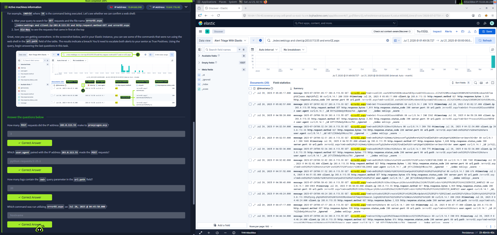

# Alert Triage With Elastic

**Platform:** TryHackMe  
**Category:** SOC / SIEM Triage  
**Tools:** Elastic (Kibana Discover)

## Summary

Investigated high-severity web alerts related to possible ProxyLogon exploitation and web shell activity. Analyzed HTTP logs in Elastic to identify malicious requests from a single external IP and confirmed command execution via a web shell.

## Key Findings

- Source IP `203.0.113.55` made multiple POST requests to `/ecp/proxyLogon.ecp`
- Same IP later sent GET requests to `errorEE.aspx` containing `cmd=` parameters
- Commands executed through the web shell included `hostname` and others
- User-Agent: `python-requests/2.25.1` (automated activity)
- Classified both alerts as **True Positives** and recommended escalation

## Screenshot

## Skills Demonstrated

- Elastic / Kibana log analysis
- Web attack & web shell detection
- Alert triage and prioritization
- Identifying indicators of compromise in HTTP logs
