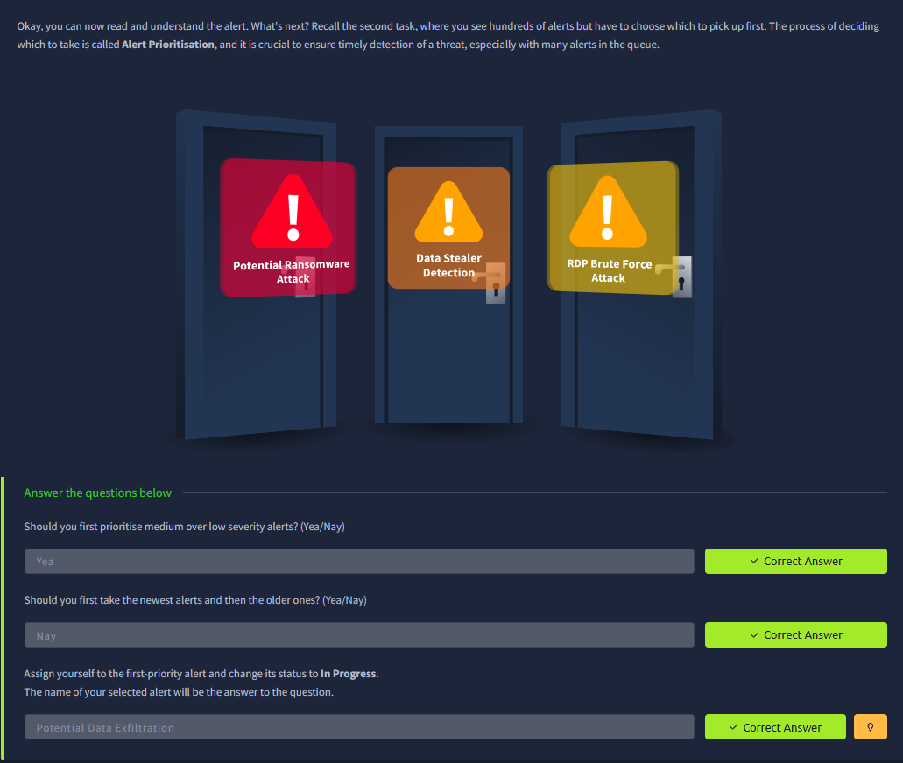
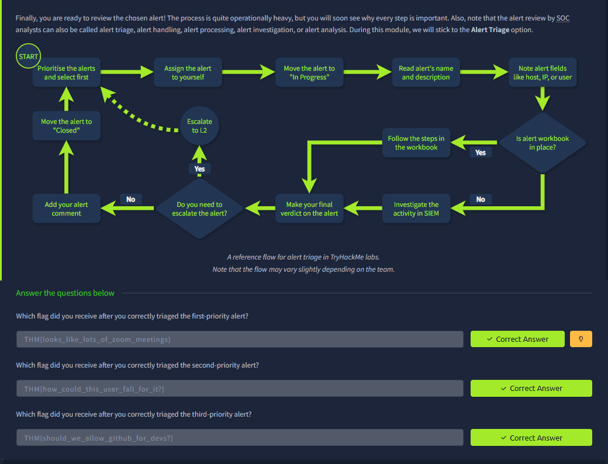

# SOC L1 Alert Triage

**Platform:** TryHackMe  
**Room:** SOC L1 Alert Triage  
**Status:** Completed

## Overview
This room teaches a systematic approach to triaging SOC alerts, including prioritisation, investigation steps, and decision-making (True Positive / False Positive / Escalate).

## Key Skills Practiced
- Alert prioritisation
- Structured alert triage process
- Decision-making using SIEM data and alert context
- Writing clear triage comments

## Evidence

### Alert Prioritisation

### Alert Triage Process & Results

