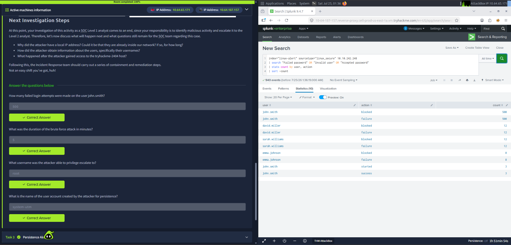

# Alert Triage With Splunk

**Platform:** TryHackMe  
**Room:** Alert Triage With Splunk  
**Status:** Completed

## Overview
This room focuses on using Splunk to investigate and triage security alerts, including brute-force attacks, persistence, and web shell activity.

## Key Skills Practiced
- Writing and refining Splunk searches
- Identifying brute-force activity from authentication logs
- Distinguishing failed vs successful logins
- Determining True Positive alerts and escalating appropriately

## Evidence
Investigated an Initial Access (brute-force) alert using Splunk. Identified 500+ failed login attempts against the user `john.smith`, confirmed successful authentication, and classified the activity as a True Positive requiring escalation.

