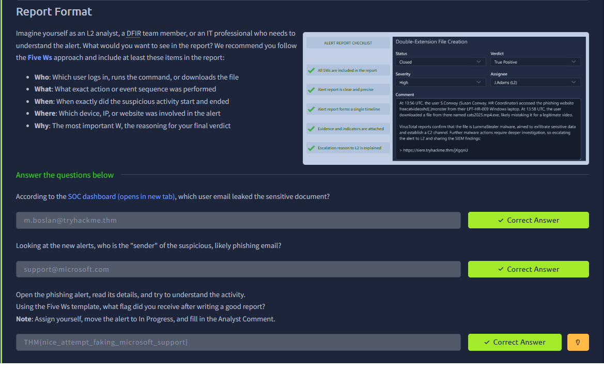

# SOC L1 Alert Reporting

**Platform:** TryHackMe  
**Room:** SOC L1 Alert Reporting  
**Status:** Completed

## Overview
This room focuses on how to properly report, document, and communicate high-risk SOC alerts using a structured approach (Five Ws).

## Key Skills Practiced
- Writing clear and concise alert reports
- Using the Five Ws framework (Who, What, When, Where, Why)
- Documenting findings for escalation and record-keeping

## Evidence
Successfully completed the reporting practical and applied the Five Ws format.

