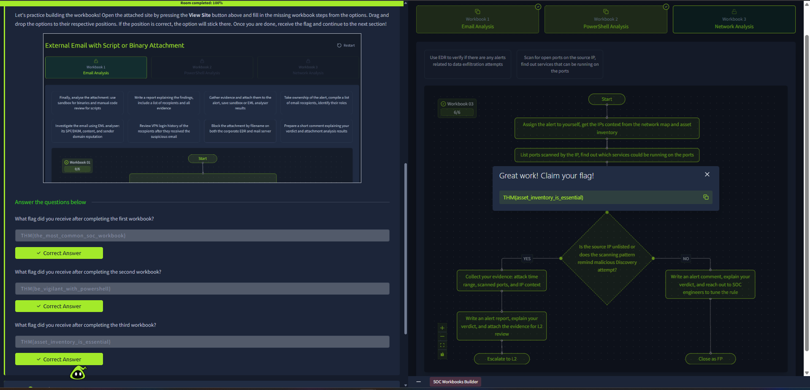

# SOC Workbooks and Lookups

**Platform:** TryHackMe  
**Room:** SOC Workbooks and Lookups  
**Status:** Completed

## Overview
This room focuses on building and using structured workbooks to standardize L1 alert triage for common scenarios (Email, PowerShell, and Network analysis).

## Key Skills Practiced
- Creating logical investigation workbooks
- Structuring triage steps for different alert types
- Decision-making (Escalate vs Close as False Positive)
- Using asset inventory and evidence collection in investigations

## Evidence
Successfully completed all three practical workbooks.

