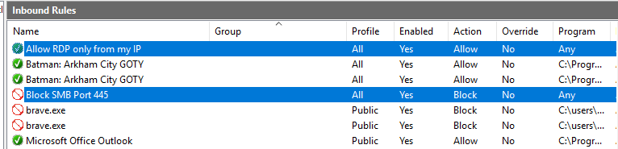
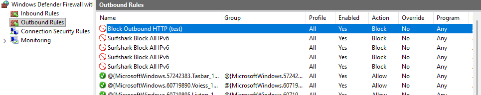
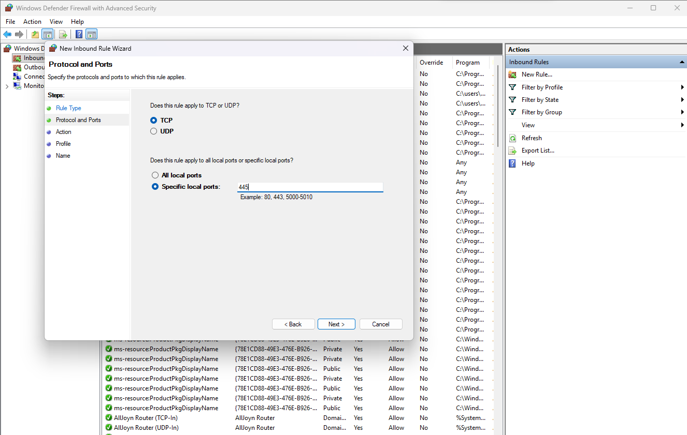
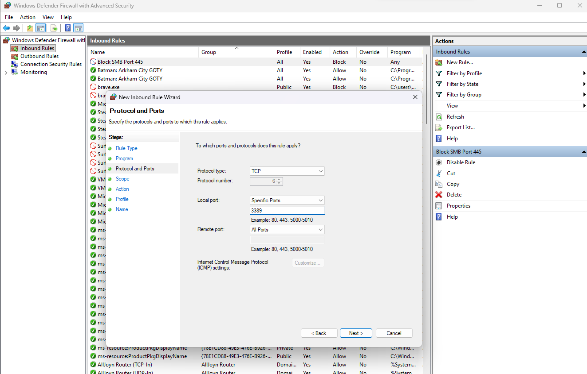
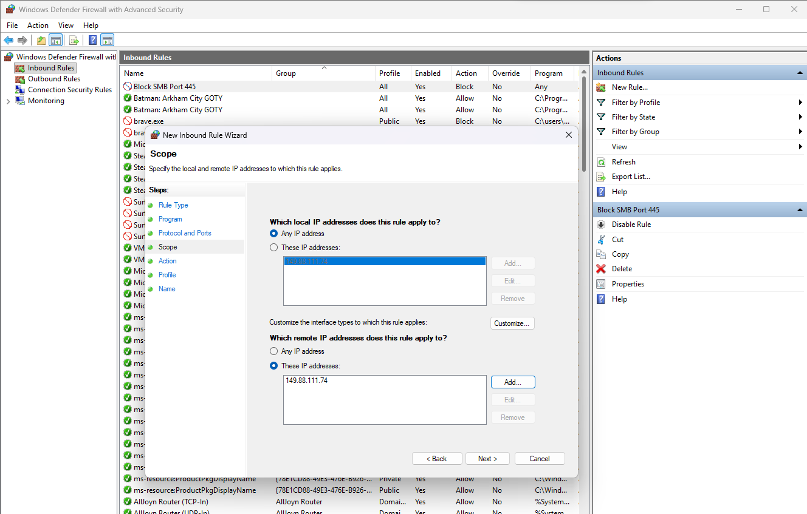
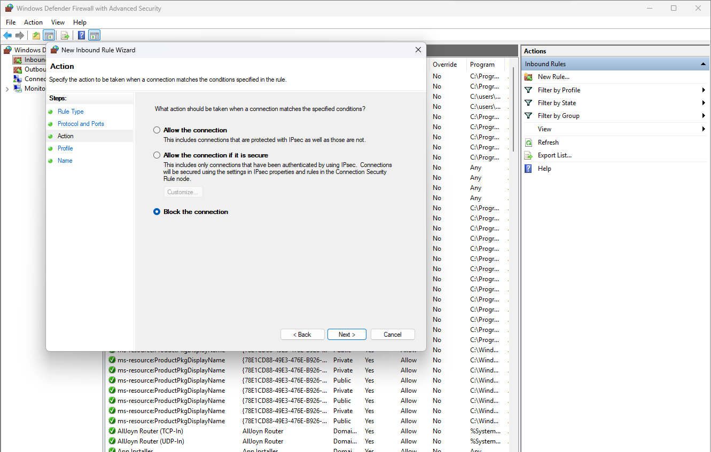
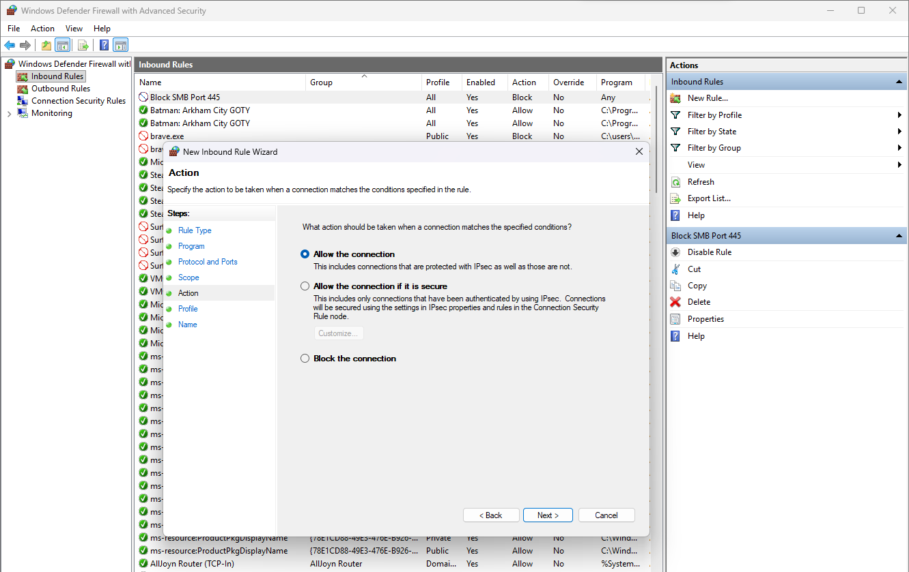
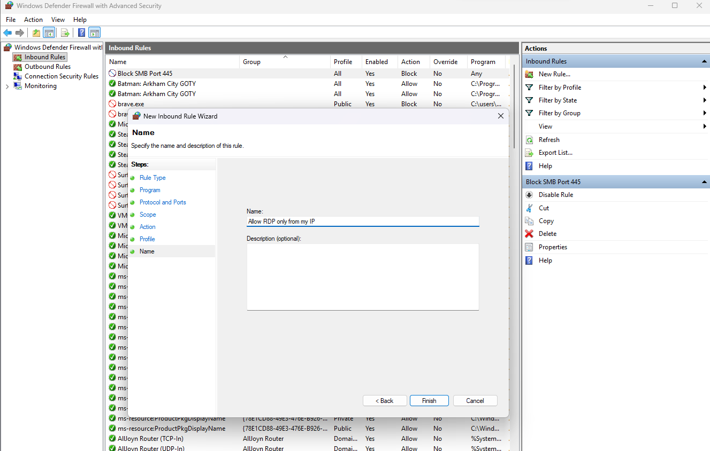
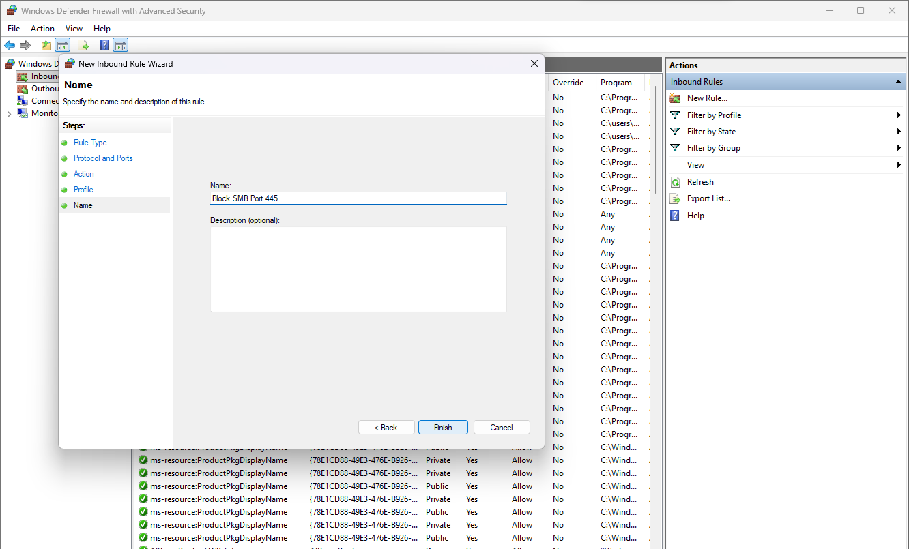

# Windows Defender Firewall Lab

## Overview
This lab demonstrates the creation and configuration of basic inbound and outbound rules in Windows Defender Firewall with Advanced Security. It covers blocking a commonly abused port (SMB), restricting remote access (RDP) to a specific source IP, and applying an outbound block for testing purposes.

## Objective
Practice creating and configuring firewall rules manually through the Windows Defender Firewall with Advanced Security console — including protocol/port configuration, scope restriction, action definition (allow vs. block), and rule naming.

## Rules Created
- Inbound rule: Block SMB (Port 445)
- Inbound rule: Allow RDP (Port 3389) only from my public IP
- Outbound rule: Block HTTP (Port 80) for testing purposes

## Screenshots

*Inbound Rules list showing the two new rules.*

*Outbound Rules list showing the HTTP block rule.*

*Protocol and Ports configuration for Port 445.*

*Protocol and Ports configuration for Port 3389.*

*Scope configuration restricting RDP to a specific IP.*

*Action: Block the connection.*

*Action: Allow the connection.*

*Naming the RDP rule.*

*Naming the SMB block rule.*

## Key Takeaways
- Translated a plain-language requirement ("block SMB", "restrict RDP") into a correctly scoped, specific firewall rule.
- Learned why scoping remote access rules to a specific IP is preferable to leaving a port open to any source.
- Practiced the inbound vs. outbound rule logic and when each applies.
- Reinforced that precise naming and protocol/port configuration matter for rule maintainability and auditability.

## Tools Used
- Windows Defender Firewall with Advanced Security
